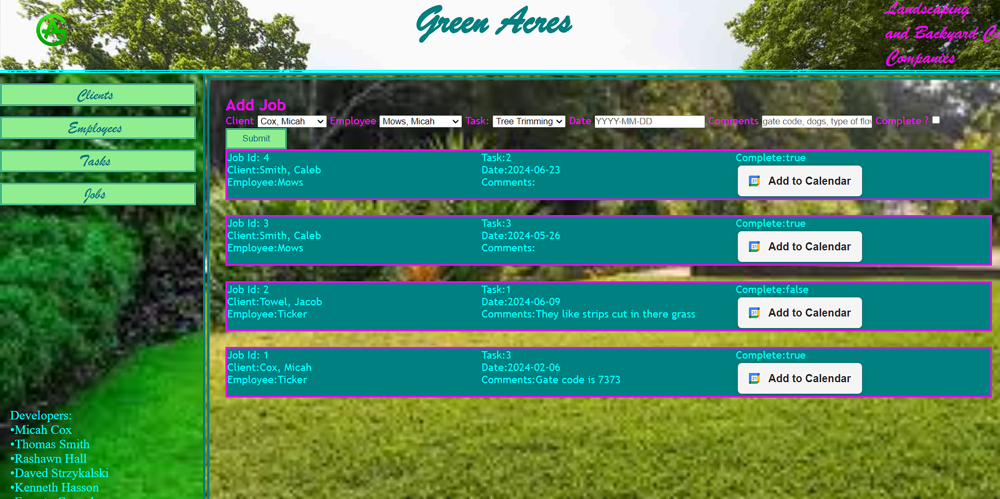
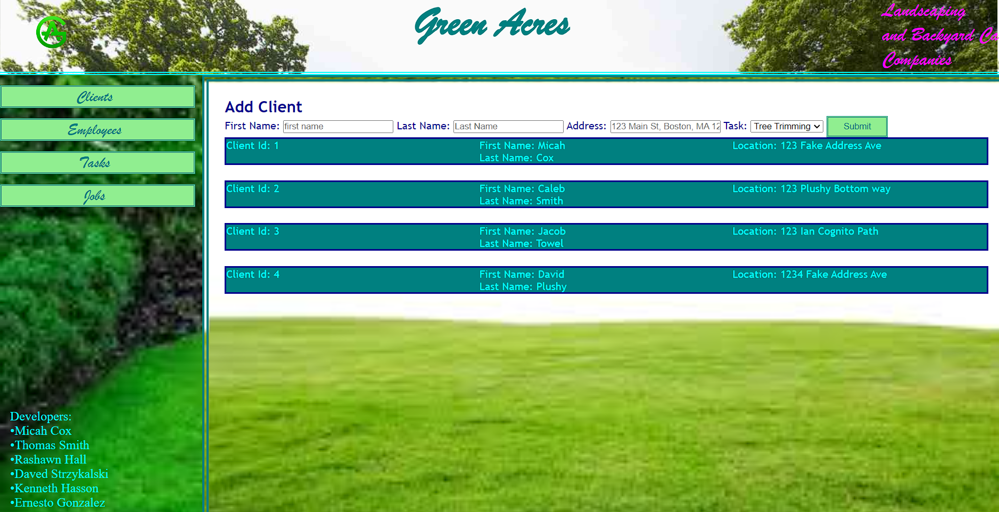

# Green Acres

## Description
 We are [Green Acres](https://github.com/thomassmith0526/Project2) we are a Lawn service company. We have designed an app with the ability to keep up with our employees and jobs for the day-to-day tasks we have to complete. 
 with our application We are able to 
 - get new clients set up on the go into our system  
 - show them when we will be out to service their yards.
 - and we can even showcase each employees speciality 

[Deployed Application](https://project2-hivl.onrender.com/)

## Table Of Contents
- [Visuals](#visuals)
- [Usage](#usage)
- [Support](#support)
- [Contributors](#contributors)
- [References](#references)
- [License](#license)

## Visuals

## Usage
The Intended use of this application is for our busniess to track jobs / added clients on the go in a conveient way to advance our business ventures. 

## Support
You can contact any of the devs for support

## Contributors 

- [Micah Cox](https://github.com/Kalink52)
- [Thomas Smith](https://github.com/thomassmith0526)
- [Rashawn Hall](https://github.com/TheR16H)
- [Daved Strzykalski](https://github.com/dstrzykalski)
- [Ernesto Gonzalez](https://github.com/ErnestoAG)
- [Kenneth Hasson](https://github.com/kenneth-hass)

## References
- [Render Guide](https://coding-boot-camp.github.io/full-stack/render/render-deployment-g)
- [Add to Calendar npm](https://www.npmjs.com/package/add-to-calendar-button)

## License 
Please refer to the [LICENSE](./LICENSE) in the repo.